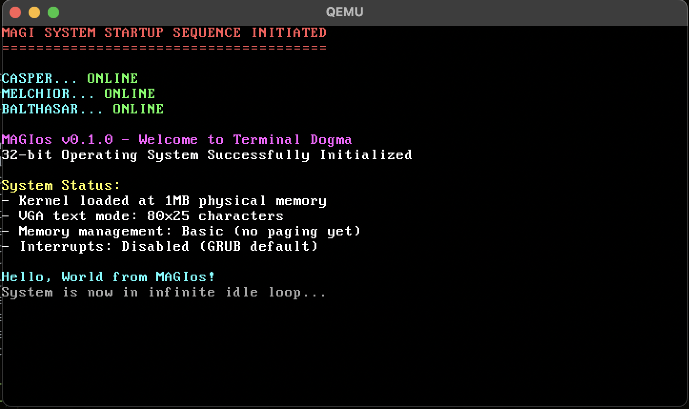

# MAGIos Swift Edition


**An experimental 32-bit operating system written in Swift, inspired by Neon Genesis Evangelion**

MAGIos is an art piece that explores what happens when you build an operating system kernel primarily in Swift, with the aesthetic and terminology of the MAGI supercomputer system from the 1990s anime _Neon Genesis Evangelion_. This is not practical software - it's an artistic and technical exploration.



## What This Is

- This is an educational piece, and a bit of an art project for me to learn how to build all sorts of software.
- I'm writing this using C and Swift, C because its a necessity, and Swift because I just love its ergonmics, I think they're a good fit for each other. That being said the features I'm using to make this possible are still experimental so we without being proped up by C I'm sure this wouldn't be possible.
- 32 bit because its complete enough to not hold me back while still being simple enough to learn with.
- I am developing this on mac but also use linux so will eventually port the build system to use a package manager.

## Quick Start

### Requirements

- **macOS** (Intel or Apple Silicon)
- **Swift Development Snapshot** (6.1+ development branch)
  - ⚠️ **Important**: Release Swift versions do NOT support Embedded Swift
  - Download from: https://www.swift.org/download/#snapshots

### Simple Build & Run

```bash
git clone <repository-url>
cd MAGIos
./build.sh --run
```

The build script will automatically:

- Install missing dependencies via Homebrew
- Verify your Swift toolchain supports Embedded Swift
- Build the Swift kernel and create a bootable ISO
- Launch MAGIos in QEMU

### Expected Output

```
========================================
MAGI SYSTEM STARTUP SEQUENCE INITIATED
========================================

     CASPER...      ONLINE
     MELCHIOR...    ONLINE
     BALTHASAR...   ONLINE

     MAGIos v0.0.1 - Swift Edition
     AT Field operational. Pattern Blue.
```

### Troubleshooting

| Issue                             | Solution                                                                 |
| --------------------------------- | ------------------------------------------------------------------------ |
| "embedded Swift is not supported" | Install Swift development snapshot, not release                          |
| "i686-elf-gcc: command not found" | Run: `brew tap nativeos/i686-elf-toolchain && brew install i686-elf-gcc` |
| Build fails                       | Check that Xcode has the development toolchain selected                  |

## Development

### Project Structure

```
MAGIos/
├── src/
│   ├── boot.s                    # x86 assembly bootloader
│   ├── kernel/
│   │   ├── kernel.c              # C bootstrap & hardware init
│   │   └── include/
│   │       └── kernel_bridge.h   # C/Swift interoperability header
│   ├── swernel/
│   │   └── swernel.swift         # Swift kernel (MAGI system core)
│   └── support/
│       ├── cstdlib/              # C standard library extensions
│       └── swtdlib/              # Swift standard library extensions
├── build.sh                      # Automated build script
├── Makefile                      # Build system (with centralized paths)
├── LLM_RULES.md                  # Guidelines for AI assistance
└── linker.ld                     # Memory layout specification
```

### Development Commands

| Command            | Purpose                     |
| ------------------ | --------------------------- |
| `./build.sh`       | Build kernel and ISO        |
| `./build.sh --run` | Build and launch in QEMU    |
| `make clean`       | Remove build artifacts      |
| `make debug`       | Launch with GDB debugging   |
| `make help`        | Show all available commands |

### Contributing

1. **Follow the Aesthetic**: Maintain Evangelion theming
2. **Swift First**: Use Swift for new features when possible
3. **Check LLM_RULES.md**: Guidelines for AI-assisted development
4. **Test in QEMU**: Verify changes boot and run correctly
