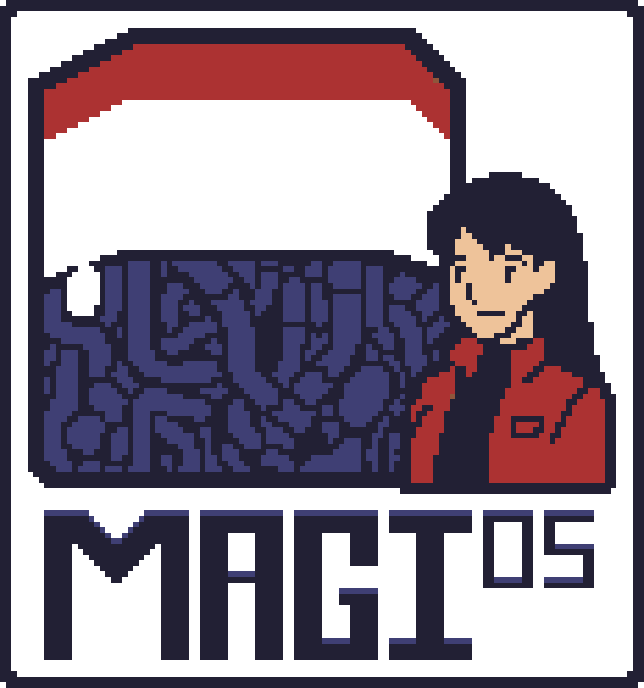

# MAGIos

A 32-bit operating system kernel written in Odin, inspired by the aesthetics and themes of Neon Genesis Evangelion.



## Overview

MAGIos is experimental. It is a conduit for me to learn how an OS works as well as giving me an outlet for creativity.

I have chosen Odin for this project as out of the choices, it filled me with the least sadness over leaving my beloved swift behind. Although so far its been a glorious choice and will most likely be my chosen language for everything going forward.

I do not know if I will ever make it to GUI applications, currently I am only looking at making this work as a terminal type application, possibly something that could run under something similar to WSL on Windows, but we will see.

## Features

- **Pure Odin Implementation**: Kernel logic written entirely in Odin with minimal assembly bootstrap
- **Evangelion Theming**: Designed to mimic the MAGI system as that aspect of Evangelion has always fascinated me.
- **VGA Text Mode**: Classic 80x25 character display with 16 colors
- **Multiboot Compliant**: Boots via GRUB bootloader
- **Cross-Platform Build**: Supports macOS and Linux development environments

## Requirements

- Odin compiler (latest version)
- i686-elf cross-compiler toolchain
- NASM assembler
- QEMU emulator
- GRUB tools (grub-mkrescue)

### Installing Dependencies (macOS)

```bash
# Install Homebrew if not already installed
/bin/bash -c "$(curl -fsSL https://raw.githubusercontent.com/Homebrew/install/HEAD/install.sh)"

# Install tools
brew install nasm qemu

# Install cross-compiler
brew tap nativeos/i686-elf-toolchain
brew install i686-elf-toolchain

# Install Odin from https://odin-lang.org/docs/install/
```

## Build and Run

```bash
# Run in QEMU with GUI
./build.sh --run

# Run in headless mode (for testing)
./build.sh --test

# Clean build artifacts
./build.sh --clean
```

### Odin Kernel Details

The kernel is compiled with these Odin flags:

- `-target:freestanding_i386` - No OS dependencies
- `-no-bounds-check` - Disable runtime bounds checking
- `-no-crt` - No C runtime
- `-default-to-nil-allocator` - No default allocator
- `-no-entry-point` - Custom entry from assembly

## License

This project is licensed under the GNU GENERAL PUBLIC LICENSE Version 3.

## Acknowledgments

- Inspired by Neon Genesis Evangelion by Hideaki Anno
- Built with the Odin programming language by gingerBill
- Multiboot specification by Free Software Foundation

---

"God's in his heaven, all's right with the world." - NERv Moto

"Get in the fucking robot shinji" - Commander Ikari
